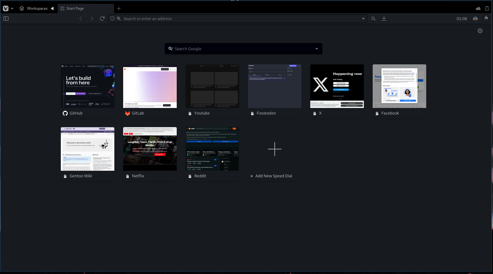

  

<h3 align="center">Decay Vivaldi</h3>

### Decay

### Decayce

### Dark Decay

### Light Decay

## Installation

First download the ZIP of the theme you like, then in Vivaldi's settings go to Themes and Open Theme, then select the zip file.
